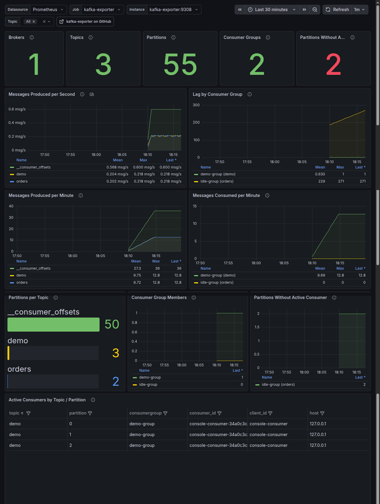

kafka-exporter
==============

[](https://github.com/rfvbkm/kafka-exporter/actions/workflows/ci.yml) [](https://hub.docker.com/r/rfvbkm/kafka-exporter) [](https://goreportcard.com/report/github.com/rfvbkm/kafka-exporter) [](https://github.com/rfvbkm/kafka-exporter) [](https://www.apache.org/licenses/LICENSE-2.0.html)

Kafka exporter for Prometheus. For other metrics from Kafka, have a look at the [JMX exporter](https://github.com/prometheus/jmx_exporter).

About
-----

This project is inspired by and maintained as a fork of [danielqsj/kafka_exporter](https://github.com/danielqsj/kafka_exporter). It keeps the same Prometheus scrape model, flags, and existing metric names. Main differences from upstream:

- **Faster metrics collection** — topic partition offsets are fetched in batches per leader broker; the same offset map is reused when computing consumer group lag; committed offsets are read via each group's coordinator; consumer groups are processed in parallel (`--group.workers`, default `100`). Together these reduce scrape time and Kafka RPC load on large clusters.
- **New metric** — [`kafka_topic_partition_consumer`](#topics) reports whether a consumer group has an active member on a topic/partition (`1` if assigned, `0` if the group has a committed offset but no active member), with labels `consumergroup`, `consumer_id`, `host`, and `client_id`.

See [CHANGELOG.md](CHANGELOG.md) for release notes. Use this repository for the changes above; use [upstream](https://github.com/danielqsj/kafka_exporter) for the original unmodified exporter.

Table of Contents
-----------------

- [About](#about)
- [Breaking Changes from Upstream](#breaking-changes-from-upstream)
- [Compatibility](#compatibility)
- [Dependency](#dependency)
- [Download](#download)
- [Compile](#compile)
  - [Build Binary](#build-binary)
  - [Build Docker Image](#build-docker-image)
- [Testing](#testing)
- [Run](#run)
  - [Run Binary](#run-binary)
  - [Run Docker Image](#run-docker-image)
  - [Run Docker Compose](#run-docker-compose)
- [Flags](#flags)
  - [Notes](#notes)
- [Metrics](#metrics)
  - [Brokers](#brokers)
  - [Topics](#topics)
  - [Consumer Groups](#consumer-groups)
- [Grafana Dashboard](#grafana-dashboard)
- [Contribute](#contribute)
- [License](#license)

Breaking Changes from Upstream
------------------------------

Since version 3.0.0 this repository is maintained as a standalone project. If you are migrating from [danielqsj/kafka_exporter](https://github.com/danielqsj/kafka_exporter), note the following incompatibilities:

| What             | Upstream / `v2.0.0`                  | This project (`v3.0.0+`)                      |
|------------------|---------------------------------------|-----------------------------------------------|
| Binary name      | `kafka_exporter`                      | `kafka-exporter`                              |
| Docker image     | `danielqsj/kafka-exporter` / `rfvbkm/kafka-exporter` | [`rfvbkm/kafka-exporter`](https://hub.docker.com/r/rfvbkm/kafka-exporter) |
| Go module path   | `github.com/danielqsj/kafka_exporter` / `github.com/rfvbkm/kafka_exporter` | `github.com/rfvbkm/kafka-exporter` |
| Versioning       | upstream releases (`v1.x`)            | independent releases starting from `v2.0.0`   |

The git history was rewritten to remove commits that included the `vendor/` directory and make the repository lighter. Clones and forks created before the rewrite are not compatible with the current repository — re-clone instead of pulling.

Prometheus metric names, labels, and command-line flags remain compatible with upstream; this fork only adds new metrics and flags (see [About](#about)). Update paths in scripts, Dockerfiles, systemd units, and Kubernetes manifests that reference the old binary or image name.

Compatibility
-------------

Support [Apache Kafka](https://kafka.apache.org) version 0.10.1.0 (and later).

Dependency
----------

- [Prometheus](https://prometheus.io)
- [Sarama](https://shopify.github.io/sarama)
- [Golang](https://golang.org)

Download
--------

Binary can be downloaded from [Releases](https://github.com/rfvbkm/kafka-exporter/releases) page.

Compile
-------

### Build Binary

```shell
make
```

### Build Docker Image

```shell
make docker
```

Testing
-------

The project has fast unit tests (no Kafka required) and integration tests that scrape a real broker.

### Unit tests

```shell
make test
```

Runs `go test -short`: certificate helpers, consumer metric filters, OAuth token caching, and other pure logic. Integration tests are skipped via `testing.Short()`.

### Integration tests

```shell
make test-integration
```

Runs `TestIntegrationSmoke` against Kafka at `localhost:9092` (override with `KAFKA_BROKERS`, comma-separated). The target:

- starts `apache/kafka:4.3.0` from [`dev/docker-compose.yml`](dev/docker-compose.yml) if no broker is reachable;
- waits until Kafka responds to metadata requests (`dev/wait-kafka`);
- checks `/healthz` and `/metrics` (`kafka_brokers`, `kafka_topic_partitions`);
- runs `docker compose down` when it started the stack itself (already-running Kafka is left untouched).

### All tests

```shell
make test-all
```

Runs unit tests first, then integration tests.

### Local Kafka only

To keep a broker running between test runs:

```shell
make ensure-kafka
# or
docker compose -f dev/docker-compose.yml up -d
```

CI runs `make test` in the lint job and `make test-integration` in a separate job with an `apache/kafka:4.3.0` service container.

Docker Hub Image
----------------

```shell
docker pull rfvbkm/kafka-exporter:latest
```

It can be used directly instead of having to build the image yourself. ([Docker Hub rfvbkm/kafka-exporter](https://hub.docker.com/r/rfvbkm/kafka-exporter))

Run
---

### Run Binary

```shell
kafka_exporter --kafka.server=kafka:9092 [--kafka.server=another-server ...]
```

### Run Docker Image

```
docker run -ti --rm -p 9308:9308 rfvbkm/kafka-exporter --kafka.server=kafka:9092 [--kafka.server=another-server ...]
```

### Run Docker Compose
make a `docker-compose.yml` flie
```
services:
  kafka-exporter:
    image: rfvbkm/kafka-exporter
    command: ["--kafka.server=kafka:9092", "[--kafka.server=another-server ...]"]
    ports:
      - 9308:9308     
```
then run it
```
docker-compose up -d
```

Flags
-----

This image is configurable using different flags

| Flag name                      | Default        | Description                                                                                                                                    |
|--------------------------------|----------------|------------------------------------------------------------------------------------------------------------------------------------------------|
| kafka.server                   | kafka:9092     | Addresses (host:port) of Kafka server                                                                                                          |
| kafka.version                  | 2.0.0          | Kafka broker version                                                                                                                           |
| sasl.enabled                   | false          | Connect using SASL/PLAIN                                                                                                                       |
| sasl.handshake                 | true           | Only set this to false if using a non-Kafka SASL proxy                                                                                         |
| sasl.username                  |                | SASL user name                                                                                                                                 |
| sasl.password                  |                | SASL user password                                                                                                                             |
| sasl.mechanism                 | plain          | SASL SCRAM SHA algorithm: sha256 or sha512 or SASL mechanism: gssapi, awsiam or oauthbearer                                                    |
| sasl.aws-region                | AWS_REGION env | The AWS region for IAM SASL authentication                                                                                                     |
| sasl.oauthbearer-token-url     |                | The url to retrieve OAuthBearer tokens from, for OAuthBearer SASL authentication                                                               |
| sasl.oauthbearer-scopes        |                | The comma-separated scopes to use for OAuthBearer SASL authentication authentication                                                               |
| sasl.service-name              |                | Service name when using Kerberos Auth                                                                                                          |
| sasl.kerberos-config-path      |                | Kerberos config path                                                                                                                           |
| sasl.realm                     |                | Kerberos realm                                                                                                                                 |
| sasl.keytab-path               |                | Kerberos keytab file path                                                                                                                      |
| sasl.kerberos-auth-type        |                | Kerberos auth type. Either 'keytabAuth' or 'userAuth'                                                                                          |
| tls.enabled                    | false          | Connect to Kafka using TLS                                                                                                                     |
| tls.server-name                |                | Used to verify the hostname on the returned certificates unless tls.insecure-skip-tls-verify is given. The kafka server's name should be given |
| tls.ca-file                    |                | The optional certificate authority file for Kafka TLS client authentication                                                                    |
| tls.cert-file                  |                | The optional certificate file for Kafka client authentication                                                                                  |
| tls.key-file                   |                | The optional key file for Kafka client authentication                                                                                          |
| tls.insecure-skip-tls-verify   | false          | If true, the server's certificate will not be checked for validity                                                                             |
| server.tls.enabled             | false          | Enable TLS for web server                                                                                                                      |
| server.tls.mutual-auth-enabled | false          | Enable TLS client mutual authentication                                                                                                        |
| server.tls.ca-file             |                | The certificate authority file for the web server                                                                                              |
| server.tls.cert-file           |                | The certificate file for the web server                                                                                                        |
| server.tls.key-file            |                | The key file for the web server                                                                                                                |
| topic.filter                   | .*             | Regex that determines which topics to collect                                                                                                  |
| topic.exclude                  | ^$             | Regex that determines which topics to exclude                                                                                                  |
| group.filter                   | .*             | Regex that determines which consumer groups to collect                                                                                         |
| group.exclude                  | ^$             | Regex that determines which consumer groups to exclude                                                                                         |
| web.listen-address             | :9308          | Address to listen on for web interface and telemetry                                                                                           |
| web.telemetry-path             | /metrics       | Path under which to expose metrics                                                                                                             |
| log.enable-sarama              | false          | Turn on Sarama logging                                                                                                                         |
| use.consumelag.zookeeper       | false          | if you need to use a group from zookeeper                                                                                                      |
| zookeeper.server               | localhost:2181 | Address (hosts) of zookeeper server                                                                                                            |
| kafka.labels                   |                | Kafka cluster name                                                                                                                             |
| refresh.metadata               | 30s            | Metadata refresh interval                                                                                                                      |
| offset.show-all                | true           | Whether show the offset/lag for all consumer group, otherwise, only show connected consumer groups                                             |
| concurrent.enable              | false          | If true, all scrapes will trigger kafka operations otherwise, they will share results. WARN: This should be disabled on large clusters         |
| topic.workers                  | 100            | Number of topic workers                                                                                                                        |
| group.workers                  | 100            | Number of consumer group workers (parallel lag/offset collection)                                                                              |
| verbosity                      | 0              | Verbosity log level                                                                                                                            |

### Notes

Boolean values are uniquely managed by [Kingpin](https://github.com/alecthomas/kingpin/blob/master/README.md#boolean-values). Each boolean flag will have a negative complement:
`--<name>` and `--no-<name>`.

For example:

If you need to disable `sasl.handshake`, you could add flag `--no-sasl.handshake`

Metrics
-------

Documents about exposed Prometheus metrics.

For details on the underlying metrics please see [Apache Kafka](https://kafka.apache.org/documentation).

### Brokers

**Metrics details**

| Name                | Exposed informations                   |
|---------------------|----------------------------------------|
| `kafka_brokers`     | Number of Brokers in the Kafka Cluster |
| `kafka_broker_info` | Information about the Kafka Broker     |

**Metrics output example**

```txt
# HELP kafka_brokers Number of Brokers in the Kafka Cluster.
# TYPE kafka_brokers gauge
kafka_brokers 3
# HELP kafka_broker_info Information about the Kafka Broker.
# TYPE kafka_broker_info gauge
kafka_broker_info{address="b-1.kafka-example.org:9092",id="1"} 1
kafka_broker_info{address="b-2.kafka-example.org:9092",id="2"} 2
kafka_broker_info{address="b-3.kafka-example.org:9092",id="3"} 3
```

### Topics

**Required permissions**

Describe all topics.

**Metrics details**

| Name                                               | Exposed informations                                |
|----------------------------------------------------|-----------------------------------------------------|
| `kafka_topic_partitions`                           | Number of partitions for this Topic                 |
| `kafka_topic_partition_current_offset`             | Current Offset of a Broker at Topic/Partition       |
| `kafka_topic_partition_oldest_offset`              | Oldest Offset of a Broker at Topic/Partition        |
| `kafka_topic_partition_in_sync_replica`            | Number of In-Sync Replicas for this Topic/Partition |
| `kafka_topic_partition_leader`                     | Leader Broker ID of this Topic/Partition            |
| `kafka_topic_partition_leader_is_preferred`        | 1 if Topic/Partition is using the Preferred Broker  |
| `kafka_topic_partition_replicas`                   | Number of Replicas for this Topic/Partition         |
| `kafka_topic_partition_under_replicated_partition` | 1 if Topic/Partition is under Replicated            |
| `kafka_topic_partition_consumer`                   | Active consumer on topic partition (1 if assigned, 0 if the group consumes but has no active member on the partition) |

**Metrics output example**

```txt
# HELP kafka_topic_partitions Number of partitions for this Topic
# TYPE kafka_topic_partitions gauge
kafka_topic_partitions{topic="__consumer_offsets"} 50

# HELP kafka_topic_partition_current_offset Current Offset of a Broker at Topic/Partition
# TYPE kafka_topic_partition_current_offset gauge
kafka_topic_partition_current_offset{partition="0",topic="__consumer_offsets"} 0

# HELP kafka_topic_partition_oldest_offset Oldest Offset of a Broker at Topic/Partition
# TYPE kafka_topic_partition_oldest_offset gauge
kafka_topic_partition_oldest_offset{partition="0",topic="__consumer_offsets"} 0

# HELP kafka_topic_partition_in_sync_replica Number of In-Sync Replicas for this Topic/Partition
# TYPE kafka_topic_partition_in_sync_replica gauge
kafka_topic_partition_in_sync_replica{partition="0",topic="__consumer_offsets"} 3

# HELP kafka_topic_partition_leader Leader Broker ID of this Topic/Partition
# TYPE kafka_topic_partition_leader gauge
kafka_topic_partition_leader{partition="0",topic="__consumer_offsets"} 0

# HELP kafka_topic_partition_leader_is_preferred 1 if Topic/Partition is using the Preferred Broker
# TYPE kafka_topic_partition_leader_is_preferred gauge
kafka_topic_partition_leader_is_preferred{partition="0",topic="__consumer_offsets"} 1

# HELP kafka_topic_partition_replicas Number of Replicas for this Topic/Partition
# TYPE kafka_topic_partition_replicas gauge
kafka_topic_partition_replicas{partition="0",topic="__consumer_offsets"} 3

# HELP kafka_topic_partition_under_replicated_partition 1 if Topic/Partition is under Replicated
# TYPE kafka_topic_partition_under_replicated_partition gauge
kafka_topic_partition_under_replicated_partition{partition="0",topic="__consumer_offsets"} 0

# HELP kafka_topic_partition_consumer Active consumer on topic partition (1 if assigned, 0 if group consumes but no active member)
# TYPE kafka_topic_partition_consumer gauge
kafka_topic_partition_consumer{client_id="my-client",consumergroup="my-group",consumer_id="my-client-abc",host="10.0.0.1",partition="3",topic="my-topic"} 1
kafka_topic_partition_consumer{client_id="-",consumergroup="my-group",consumer_id="-",host="-",partition="0",topic="my-topic"} 0
```

Labels for `kafka_topic_partition_consumer`: `topic`, `partition`, `consumergroup`, `consumer_id`, `host`, `client_id`. Value **0** uses `"-"` for consumer labels when the group has a committed offset on the partition but no active member (same as `kafka-consumer-groups.sh --describe` with no active members). Requires **Describe** consumer groups. On large clusters, tighten `topic.filter` and `group.filter` to limit time series cardinality.

Example PromQL:

```promql
kafka_topic_partition_consumer{topic="my-topic", consumer_id!="-"} == 1
kafka_topic_partition_consumer{consumergroup="my-group", consumer_id="-"} == 0
count(kafka_topic_partition_consumer{topic="my-topic", consumer_id!="-"} == 1) by (topic)
```

### Consumer Groups

**Required permissions**

Describe all groups.

**Metrics details**

| Name                                         | Exposed informations                                                     |
|----------------------------------------------|--------------------------------------------------------------------------|
| `kafka_consumergroup_current_offset`         | Current Offset of a ConsumerGroup at Topic/Partition                     |
| `kafka_consumergroup_current_offset_sum`     | Current Offset of a ConsumerGroup at Topic for all partitions            |
| `kafka_consumergroup_lag`                    | Current Approximate Lag of a ConsumerGroup at Topic/Partition            |
| `kafka_consumergroup_lag_sum`                | Current Approximate Lag of a ConsumerGroup at Topic for all partitions   |
| `kafka_consumergroupzookeeper_lag_zookeeper` | Current Approximate Lag(zookeeper) of a ConsumerGroup at Topic/Partition |
| `kafka_consumergroup_members`                | Amount of members in a consumer group                                    |

#### Important Note

To be able to collect the metrics `kafka_consumergroupzookeeper_lag_zookeeper`, you must set the following flags:

* `use.consumelag.zookeeper`: enable collect consume lag from zookeeper
* `zookeeper.server`: address for connection to zookeeper

**Metrics output example**

```txt
# HELP kafka_consumergroup_current_offset Current Offset of a ConsumerGroup at Topic/Partition
# TYPE kafka_consumergroup_current_offset gauge
kafka_consumergroup_current_offset{consumergroup="KMOffsetCache-kafka-manager-3806276532-ml44w",partition="0",topic="__consumer_offsets"} -1

# HELP kafka_consumergroup_current_offset_sum Current Offset of a ConsumerGroup at Topic for all partitions
# TYPE kafka_consumergroup_current_offset_sum gauge
kafka_consumergroup_current_offset_sum{consumergroup="KMOffsetCache-kafka-manager-3806276532-ml44w",topic="__consumer_offsets"} -1

# HELP kafka_consumergroup_lag Current Approximate Lag of a ConsumerGroup at Topic/Partition
# TYPE kafka_consumergroup_lag gauge
kafka_consumergroup_lag{consumergroup="KMOffsetCache-kafka-manager-3806276532-ml44w",partition="0",topic="__consumer_offsets"} 1

# HELP kafka_consumergroup_lag_sum Current Approximate Lag of a ConsumerGroup at Topic for all partitions
# TYPE kafka_consumergroup_lag_sum gauge
kafka_consumergroup_lag_sum{consumergroup="KMOffsetCache-kafka-manager-3806276532-ml44w",topic="__consumer_offsets"} 1

# HELP kafka_consumergroup_members Amount of members in a consumer group
# TYPE kafka_consumergroup_members gauge
kafka_consumergroup_members{consumergroup="KMOffsetCache-kafka-manager-3806276532-ml44w"} 1

```

#### Do not see any Consumer group or Lag information

The consumer group metrics would not be available, if there is no consumer with a consumer group.

Run consumer with a consumer group using command line tool
```bash
kafka-console-consumer.sh \
    --consumer.config /path/to/client.properties \
    --bootstrap-server localhost:9092 \
    --topic test \
    --group test-conusmer-group \
    --from-beginning
```

Grafana Dashboard
-------

The [Kafka Exporter Overview](kafka_exporter_overview.json) dashboard covers all metrics exposed by this exporter, including the [`kafka_topic_partition_consumer`](#topics) metric: active consumer assignment per topic/partition and partitions without an active consumer.

Import it manually: Grafana → Dashboards → New → Import → upload [`kafka_exporter_overview.json`](kafka_exporter_overview.json) and select your Prometheus datasource.

A community listing on [grafana.com](https://grafana.com/grafana/dashboards/) will be added once the portal accepts uploads again.

Panels:

- Overview stats: brokers, topics, partitions, consumer groups, partitions without active consumer.
- Messages produced per second / per minute, messages consumed per minute.
- Lag by consumer group.
- Partitions per topic, consumer group members.
- Partitions without active consumer (per topic and consumer group).
- Active consumers by topic/partition with `consumergroup`, `consumer_id`, `client_id`, and `host`.



The upstream dashboard [7589](https://grafana.com/grafana/dashboards/7589-kafka-exporter-overview/) also works with this exporter but does not include the new metric panels.

Contribute
----------

Pull requests are welcome in the [repository](https://github.com/rfvbkm/kafka-exporter/pulls).

License
-------

Code is licensed under the [Apache License 2.0](LICENSE).
